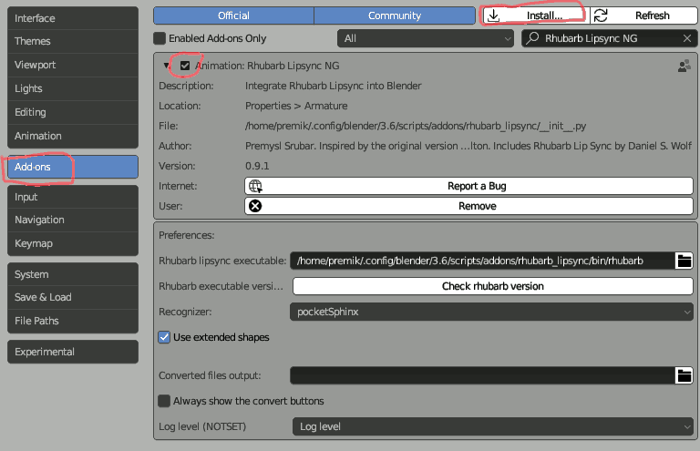

# Rhubarb Lip Sync NG - Blender plugin

Inspired by the [scaredyfish/blender-rhubarb-lipsync](https://github.com/scaredyfish/blender-rhubarb-lipsync).

## Quick start

### Installation

1. Go to the [releases page](https://github.com/Premik/blender_rhubarb_lipsync_ng/releases/latest) and download the `rhubarb_lipsync_ng<your_system>*.zip` anywhere to your PC. For example `rhubarb_lipsync_ng-Windows-0.9.1.zip` for Windows.

2. Run Blender, go to the `Main menu/Edit/Preferences/Addons`. Click the **Install** button (top right) and select the downloaded zip (don't unzip the file).

3. After short moment the plugin would install and show up. **Enable the plugin** by ticking the checkbox in front of the plugin name.

4. Verify the `rhubarb` executable is working by pressing the **Check rhubarb version**. Note the plugin wraps the executable from [rhubarb-lip-sync](https://github.com/DanielSWolf/rhubarb-lip-sync) project.

### Create capture
Note: Generally, each time you see a button is disabled hover the mouse cursor over the button and a popup would show the reason.
1. There should now be new ***RLSP*** tab visible in the 3d view with two panels. First create new `Capture` in the current scene by pressing **Create capture** button in the `RLSP: Sound setup and cues capture` panel.

1. Select a sound file. 
   * Note the plugin can convert sound files to the supported formats.
   * For better experience: Enable **Audio Scrubbing**, **Cache** and **Sync to Audio**
   * Optionally place the `sound strip` to the `Sequencer` by pressing **Place as Strip** button. You can set the start frame here. But if you change the start frame later, you need to remove the strip and place it again.
   

1. Press the **Capture** button. The list of Cues should get populated. Note:
   * The capture task runs in background. So you can still use Blender while it is runninig. You can even create and run another capture(s) concurently.
   * The underlying `rhubarb cli` is also able to utilize multiple-threads. But only for longer sound clips. It runs single-threaded for sort sounds.
   * There are additional capture options available when pressing the small `⌄` button beside the `Capture` button. Like Dialog file or extended-shapes usage.

1. You can preview the captured cues by clicking on the cue lists. Too short or too long cues are highlighted in red. You can also start playback and the small icon would follow the cues. But there is probably some refreshing-bug and sometimes the icon doesn't refresh unless mouse cursor is moving over the panel.

### Map cues to Actions and bake

1. Open the other panel `RLSP: Cue mapping and baking` and select the `Object` you wan't to animate. Typically an armature. Note:
   * Shape Keys support is still WIP.
   * Usually your `Actions` would have a single keyframe on the first frame (a.k.a. pose). But multi-frame actions are supported as well.
   * The Capture currently selected in the `RLSP: Sound setup and cues capture` panel is the one which would get baked. You can have multiple Captures and baked them one-by-one reusing the same mapping.   

1. For each `Cue type` select the apropriate Action. You can use the `?` button to show a hint about the expected mouth shape (copied from the `rhubarb-cli` page). 
   * Note you can map the same `Action` to multiple `Cue types`. For instance `A` and `X`.
   * Note you can create mapping on multiple `Objects`. If your animation/pose doesn't involve a single armature or is a composed from multiple objects.

1. Select or create `NLA Tracks`. It is possible to place the mapped Cue actions to a single track. But **two tracks** are preferable. Since it alows the placed `Action strips` to interleave and blend automatically.

1. You can tweak the `Strip placement settings`. Note this section is still very *draft* and would need some redesign:

1. Press the **Bake to NLA** button. Additional dialog would open.
   * If you have mapping on multiple `Objects` change the `Bake mode`. By default all `Objects` are baked.
   * Enable **Use subframes**. Especially if your fps is low (<60). Often the cues are crowded/short and this would reduce clashing/collapsing. You can then do manuall cleanup in the NLA editor and disable the subframes visibility again (Blender always store frames as floats internally). Note the current baking process always use sub-frames (non integer frames) even when this tickbox is disabled (TBD).

1. Review errors/warnings and press the **Ok** button. Note: 
   * The baking might work even with some errors/warning.
   * If you are repeating the bake again you can press the **Remove strips** button to remove the previous baked `Actions` and make room for new `Strips`.
1. After the baking is done review the baking report. Report is shown only when there were any baking error/warnings.

### Tweak the Action strips

1. Open the `NLA Editor`. You can tweak the position/length/blending of the `NLA Strips`. Some default Strip properties can be changed in the `Strip placement settings` section. But the `Bake to NLA` would have to be run-again (removing the existing `Strips` first).

1. If needed the `NLA Tracks` can be baked into single new `Action`. Select `NLA Editor/main menu/Edit/Bake Action`. New action would be created. The two RLPS tracks can now be removed or disabled.

## More details

Some diagrams

| Preview                                  | Click to View                |
|------------------------------------------|------------------------------|
|  | <a href="doc/diagrams/capture.svg">svg</a>|
|  | <a href="doc/diagrams/mapping.svg">svg</a> |

[Development notes](dev.md)