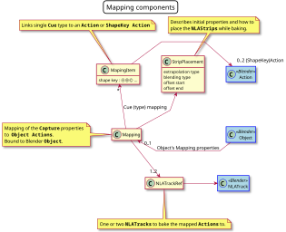

# Rhubarb Lip Sync NG - Blender plugin

Inspired by the [scaredyfish/blender-rhubarb-lipsync](https://github.com/scaredyfish/blender-rhubarb-lipsync).

## Quick start

### Video tutorials

### Installation

1. Go to the [releases page](https://github.com/Premik/blender_rhubarb_lipsync_ng/releases/latest) and download the `rhubarb_lipsync_ng<your_system>*.zip` anywhere to your PC. For example `rhubarb_lipsync_ng-Windows-1.3.0.zip` for Windows.

2. Run Blender, go to the `Main menu/Edit/Preferences/Addons`. Click the **Install** button (top right) and select the downloaded zip (don't unzip the file).

3. After short moment the plugin would install and show up. **Enable the plugin** by ticking the checkbox in front of the plugin name.

4. Verify the `rhubarb` executable is working by pressing the **Check rhubarb version**. Note the plugin wraps the executable from [rhubarb-lip-sync](https://github.com/DanielSWolf/rhubarb-lip-sync) project.

Note: Generally, each time you see a button is disabled hover the mouse cursor over the button and a popup would show the reason.

### Create capture

1. There should now be new ***RLSP*** tab visible in the 3d view with two panels. First create new `Capture` in the current scene by pressing **Create capture** button in the `RLSP: Sound setup and cues capture` panel.

1. Select a sound file. 
   * Note the plugin can convert sound files to the supported formats.
   * For better experience: Enable **Audio Scrubbing**, **Cache** and **Sync to Audio**
   * Optionally place the `sound strip` to the `Sequencer` by pressing **Place as Strip** button. You can set the start frame here. But if you change the start frame later, you need to remove the strip and place it again.
   

1. Press the **Capture** button. The list of Cues should get populated. Note:
   * The capture task runs in background. So you can still use Blender while it is runninig. You can even create and run another capture(s) concurently. But pressing `Esc` would cancel the running operator.
   * The underlying `rhubarb cli` is also able to utilize multiple-threads. But only for longer sound clips. It runs single-threaded for sort sounds.
   * There are additional capture options available when pressing the small `⌄` button beside the `Capture` button. Like extended-shapes usage or **Dialog file**. Dialog file is a sound transcription which can improve accuracy, but only works for english.

1. You can preview the captured cues by clicking on the cue lists. Too short or too long cues are highlighted in red. You can also start playback and the small icon would follow the cues. But there is probably some refreshing-bug and sometimes the icon doesn't refresh unless mouse cursor is moving over the panel.

### Map cues to Actions

1. Open the other panel `RLSP: Cue mapping and baking` and select the `Object` you want to animate. For bone animation, select an armature. For shape-key animation, select a mesh.

1. For each `Cue type`, select the appropriate Action. Note:
   * Use the `?` button to show a hint about the expected mouth shape (copied from the `rhubarb-cli` page).
   * Usually, your `Actions` would have a single keyframe on the first frame (a.k.a. pose). But multi-frame actions are supported as well.
   * It is possible to map the same `Action` to multiple `Cue types`. For instance `A` and `X`.
   * Using `Action-sheet` where multiple cues are on different frames of the same Action is supported too. Use the custom frame range button to select the desired (sub)range:

     

   * There are action filters available which can be used to narrow down the selection in the dropdowns. Use this for instance if all your poses are flagged as an asset. Or if you want to make invalid Actions (with a missing key) to show up as well.

     

1. Select or create `NLA Track` pair. It is possible to place the mapped Cue actions to a single track. But **two tracks** are preferable since it allows the placed `Action strips` to interleave and fluently blend their influence.

   

1. You can tweak the `Strip placement settings`. Note this section is currently being redesigned and will be simplified.

   

### Bake to NLA

1. Press the big **Bake to NLA** button. This will bring additional dialog up with few more baking options and information:

  

  * Select the `Capture` (cue list) to be baked. It matches the one selected in the `RLSP: Sound setup and cues capture` panel. Note it is possible to bake multiple Captures and bake them one-by-one reusing the same mapping.
  * You can again set/change the `Start Frame` here.
  * The `Object to bake` options indicates which `Objects` should be considered for baking. By default, all `Objects` with non-empty mapping would get baked at once. For example there could be mapping on the Armature with the basic animation. And then also on the mesh with some additional corrective shape-key Actions. Or could be useful where there are separate Objects for tongue and teeth.

1. Review errors/warnings and press the **Ok** button. Note: 
   * The baking might work even with some errors/warning.
   * If you are repeating the bake again you can press the **Remove strips** button to remove the previous baked `Actions` and make room for new `Strips`.
1. After the baking is done review the baking report. Report is shown only when there were any baking error/warnings.

### Tweak the Action strips

1. Open the `NLA Editor`. You can tweak the position/length/blending of the `NLA Strips`. Some default Strip properties can be changed in the `Strip placement settings` section. But the `Bake to NLA` would have to be run-again (removing the existing `Strips` first).

1. If needed the `NLA Tracks` can be baked into single new `Action`. Select `NLA Editor/main menu/Edit/Bake Action`. New action would be created. The two RLPS tracks can now be removed or disabled.

## More details

Some diagrams

| Preview                                  | Click to View                |
|------------------------------------------|------------------------------|
|  | <a href="doc/diagrams/capture.svg">svg</a>|
|  | <a href="doc/diagrams/mapping.svg">svg</a> |

[Development notes](dev.md)
