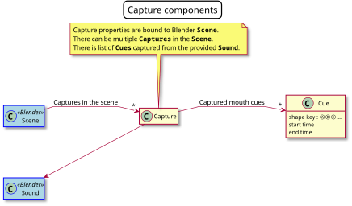

# Random dev notes


https://docs.pytest.org/en/7.1.x/explanation/goodpractices.html#src-layout

```sh

source /opt/mambaforge/etc/profile.d/conda.sh
```

https://github.com/DanielSWolf/rhubarb-lip-sync

## Diagrams

Some diagrams

| Preview                                  | Click to View                |
|------------------------------------------|------------------------------|
| <a href="doc/diagrams/capture.svg"></a> | <a href="doc/diagrams/capture.svg">svg</a>|
| <a href="doc/diagrams/mapping.svg"></a> | <a href="doc/diagrams/mapping.svg">svg</a> |


## License
`# SPDX-License-Identifier: MIT`

## Conda

### Create

Create blank env with only python/pip.

```sh
mamba create -n rhubarb -c conda-forge python=3.10 pip~=22.2 
```

Then Activate and Update the env (see below)
Note it seems it has to be done in two steps. Since the base(system) python and pip would have been used to install the dependencies instead.

### Activate

```sh
conda activate rhubarb
which python # Verify it points somewhere like `.conda/envs`. Not to the system python.
```

### Update

Activate the env first. The `--prune` is only needed if deps. were removed/renamed. Note the  `-f environment.yml` is used implicitly.
```sh
mamba env update --prune
```

### Win
Install: https://mamba.readthedocs.io/en/latest/installation.html#windows

```sh
set MAMBA_ROOT_PREFIX=r:\mm

micromamba shell init -s cmd.exe -p R:\mambaPrefix
micromamba shell hook --shell=cmd.exe
micromamba env list
micromamba create -f environment.yaml
micromamba activate rhubarb

r:\mambaPrefix\Scripts\activate
```

## Release

- Verify the rhubarb binary versions+hashes are the latest version available
- `cd scripts`
- `python rhubarb_bin.py` to download rhubar binaries and verify the checksums. It would also deploy the correct binary to the /bin folder based on the current platform (linux/mac/win).
- `python package.py` to create zipped distributions for each platform.


## Vs Code
Probably the easiest is to run the `code` or `code-oss` from within the activated conda env.
Then run `Python: Select Interpreter` and select the one from conda env.

### Pylance

```json
    "python.analysis.diagnosticSeverityOverrides": {
        "reportOptionalMemberAccess": "none",
    }
```

Already in `project.toml`. To add to the settings.json manually:
```json
 "python.formatting.provider": "black",
 "python.formatting.blackArgs": ["--line-length", "160", "--skip-string-normalization"],
 "python.formatting.blackPath": "/bin/black",
```

### bpy modules

[Fake bpy modules](https://github.com/nutti/fake-bpy-module) (seems more complete)
```json
    "python.autoComplete.extraPaths": [
        "/data/src/fake_bpy_modules_3.4-20230117"
    ],
    "python.analysis.extraPaths": [
        "/data/src/fake_bpy_modules_3.4-20230117"
    ],
```

Official bpy from pip:
```json
"python.autoComplete.extraPaths": [
        "/home/premik/.conda/envs/rhubarb/lib/python3.10/site-packages/bpy/3.4/scripts/modules/"
    ],
    "python.analysis.extraPaths": [
        "/home/premik/.conda/envs/rhubarb/lib/python3.10/site-packages/bpy/3.4/scripts/modules/"
    ],
```

Debug: https://github.com/JacquesLucke/blender_vscode
https://marketplace.visualstudio.com/items?itemName=JacquesLucke.blender-development


## Blender

###
For operator bl_idname, the same naming conventions as in 2.7x remain
Registration: Menu, Panel, Header, UIList, Operator
`UPPER_CASE_{SEPARATOR}_mixed_case` The separator for each identifier is listed below:
* Header -> _HT_
* Menu -> _MT_
* Operator -> _OT_
* Panel -> _PT_
* UIList -> _UL_

Valid Examples:
* `class OBJECT_OT_fancy_tool (and bl_idname = "object.fancy_tool")`
* `class MyFancyTool (and bl_idname = "MYADDON_MT_MyFancyTool")`
* `class SOME_HEADER_HT_my_header`
* `class PANEL123_PT_myPanel (lower case is preferred but mixed case is supported).`

https://wiki.blender.org/wiki/Reference/Release_Notes/2.80/Python_API/Addons#Registration

bpy.ops.sound.open(filepath='/tmp/work/1.ogg')

Uilist:
https://blender.stackexchange.com/questions/30444/create-an-interface-which-is-similar-to-the-material-list-box/30446#30446
https://blender.stackexchange.com/questions/8699/what-ui-would-work-for-choosing-from-a-long-long-list
https://blender.stackexchange.com/questions/717/is-it-possible-to-print-to-the-report-window-in-the-info-view

https://blender.stackexchange.com/questions/44356/fighting-split-col-and-aligning-row-content
https://sinestesia.co/blog/tutorials/using-uilists-in-blender/

Icons:
https://wilkinson.graphics/blender-icons/

Best practice:
https://docs.blender.org/api/current/info_best_practice.html


Properties
https://docs.blender.org/api/blender_python_api_master/bpy.props.html?highlight=floatproperty#get-set-example

## Todo

### High
* Mapping wizards
  * Clear - will remove the mapping (delete from the object completly?)
  * Face-it - From Test rig - Normal actions+shape-key corrections? 2) From shape-key test action 3) The final control rig (doesn't need a wizard)
  * By name - More instances (alow user defined) - will map action by matching name patterns (should provide some placeholder/expansions in the expression for objectName, etc)
  * Baking + Strip placement reorg 
    - Use the new `CueProcessor` in the ruhbard module
    - Blend in time only up to the cue start time (never after)
    - Blend out time: start fading on cue start time rounded to nearset frame (rounded up) down to the cue end time, should reduce "freezing"
    - Trim long cues, only trim the non-X

### Normal
* Add warning (in the baking validation popup?) when any selected object has an active Action (seems to be confusing for NLA newbies when the rig doesn't animate after bake because of that)
* extended shapes- seems they are generated even when disabled -check
* Integrate with: https://mecabricks.com/en/shop/product/6
* Create aur package
* Detect blender --debug and similar argument and auto-enable debug log level (and same for log file?)
* Add "auto-remove" checkbox on the Bake confirmation dialog (so one doesn'thave to press "remove cues")
* When tracks are alraedy selected and new NLA track is added sometimes this disturbs the track selection and wrong tracks get used.

### Low
* Add [speaker](https://docs.blender.org/manual/en/latest/render/output/audio/speaker.html) as an alternative to Sequencer audio clip
* The scaled down icons (32x32) still hard to see. Pre-scale different set icons?
* Verify the Dialog file is working
* Changel all labels cases to follow Blender style "Foo in Bar"
* Add some simple blender sample file
* There are still some ogg unsupported format - could have been an user error (ogg file was not really an ogg?)
* Workflow from Sequencer - Paste sound_strip first, create captures of them and render to NLA,


## Check
https://github.com/Hunanbean/Papagayo-NGLipsyncImporterForBlender
https://blendermarket.com/products/syncnix
https://blendermarket.com/products/parrot-lipsync

## NLA

NLA object tracks:

```python
[t.name for t in C.object.animation_data.nla_tracks]
```

NLA shape-key tracks:

```python
[t.name for t in C.object.data.shape_keys.animation_data.nla_tracks]
```


https://docs.blender.org/manual/en/latest/files/data_blocks.html
https://blenderartists.org/t/how-to-fix-blender-error-disabled-cant-edit-this-property-from-linked-data-block/1239469/3

Windows system console:
https://blender.stackexchange.com/questions/145890/where-is-the-system-console

https://download.blender.org/release/

```
class FaceitExpressions(PropertyGroup):
    '''Properties stored in each expression item'''
    name: StringProperty(
        options=set(),
    )
    side: StringProperty(
        options=set(),
    )
    frame: IntProperty(
        options=set(),
    )
    index: IntProperty(
        options=set(),
    )
    mirror_name: StringProperty(
        options=set(),
    )
    corr_shape_key: BoolProperty(
        name='Shape Key',
        description='Corrective Shape Key active on this expression',
        default=False
    )
    procedural: EnumProperty(
        name='Procedural Expression',
        items=PROCEDURAL_EXPRESSION_ITEMS,
    )

- Inbuilt sound converter. 

- Flexible sound -> animation mapping. Shape-keys, armature bones, action-sheets or any other combination of actions is supported. 
- No external dependencies, straightforward installation.
(collecting phoneme groups). Quick preview of captured mouth-cues.
- Comperhensive unit and integration tests ran automatically by Gitlab on windows, linux and mac runner. Breaking bugs should get detected early.
- Robust UI. Disabled buttons show reason why they are disabled when hovering on them. Detailed validations prior baking, result report, unexpected errors shown directly in UI. Not just small notification at the bottom of the screen which goes away in few seconds and is easy to miss. Background processing with proper progressbar for creating mouth-cue captures 


## Faq
- Difference between rhubarb-cli, rhubarb_lipsync, rhubarb_lipync_ng,
- Support Github tickets

## Basic troubleshooting
- Enable increase log-level in preferences. Enable login to file.
- If the issue happens early or plugin doesn't register, run `blender --debug`